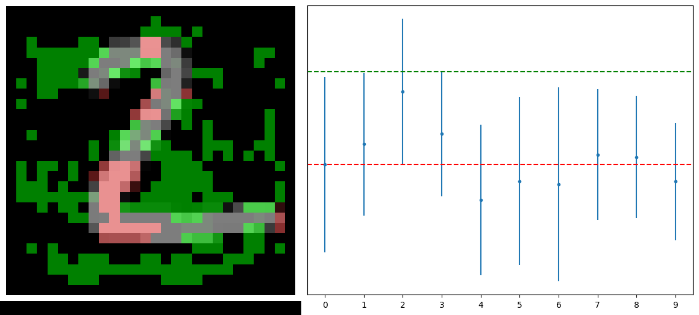
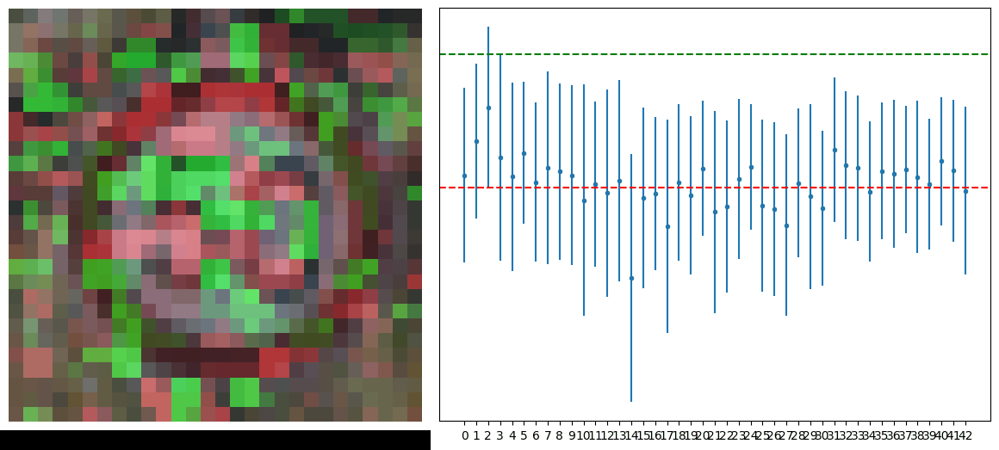
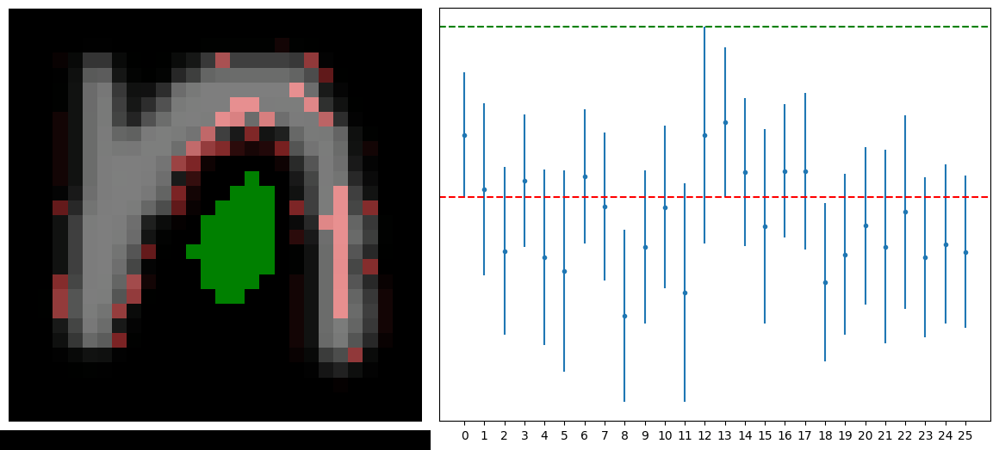
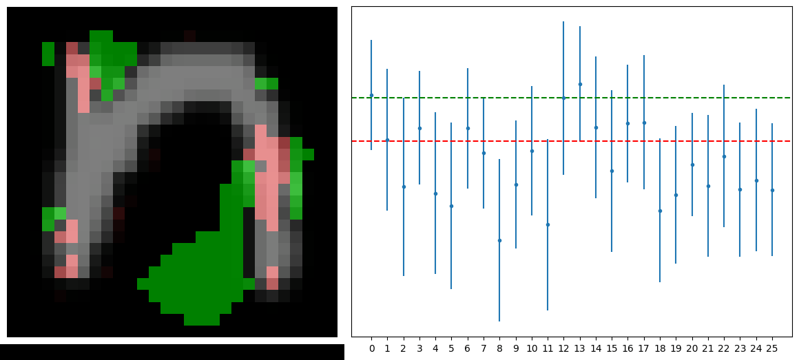
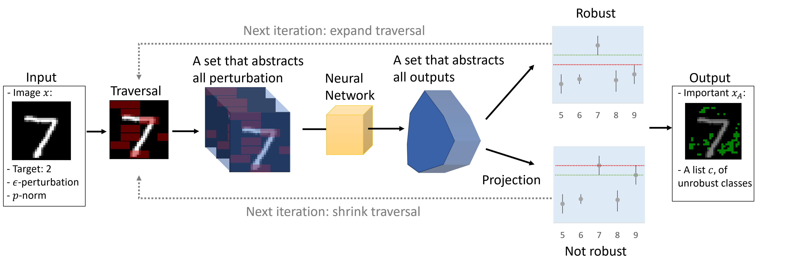

# formal-xai

**ViTaX** — *Towards Verified and Targeted Explanations through Formal Methods*

Formally verified attribution explanations for neural networks.

## Overview

ViTaX produces attribution maps that are backed by formal verification — it doesn't just estimate feature importance, it *proves* which features are sufficient to change the model's prediction under L∞ perturbation.

## Visualizations

Here are visualizations showing what ViTaX does (left side shows the original image embedded with the generation of explanation, right side shows the robustness checking in logits space):

### MNIST explanation from 2 to 3


- Time taken: 14.06 seconds
- Solver avg time: 0.96 seconds
- A (important) set: 130 | B (irrelevant) set: 654

### GTSRB explanation from speed limit 50 to 60


- Time taken: 86.98 seconds
- Solver avg time: 6.45 seconds
- A (important) set: 104 | B (irrelevant) set: 2248

### EMNIST explanation from n to m (robust example)


- Time taken: 37.19 seconds
- Solver avg time: 3.08 seconds
- A (important) set: 35 | B (irrelevant) set: 749

### EMNIST explanation from n to C (less robust example)


- Time taken: 106.67 seconds
- Solver avg time: 8.70 seconds
- A (important) set: 93 | B (irrelevant) set: 691

## Algorithm

1. **Rank** features by heuristic importance (Saliency, IG, DeepLift, SHAP, or Random)
2. **Binary search** over ranked features to find the minimal sensitive set
3. **Verify** robustness at each step via a formal verification backend (NNV/MATLAB or Marabou)



### Data Modalities

| Modality | Examples | Loader |
|----------|----------|--------|
| Image | MNIST, GTSRB, EMNIST, OrganMNIST, TaxiNet | `formal_xai.data.image` |
| Tabular | HELOC, CSV datasets | `formal_xai.data.tabular` |
| Time Series | Generic 1-D signals | `formal_xai.data.timeseries` |

## Installation

```bash
pip install -e .                # Core only
pip install -e ".[captum]"      # + Captum for IG/DeepLift/SHAP heuristics
pip install -e ".[all]"         # + all optional Python deps
```

### n2v Backend (Python — default)

The default verification backend uses [n2v](https://github.com/sammsaski/n2v),
a pure-Python reimplementation of NNV. It is included as a git submodule:

```bash
git submodule update --init --recursive
pip install -e third_party/n2v
```

### NNV Backend (MATLAB — legacy)

Requires MATLAB with the [NNV toolbox](https://github.com/verivital/nnv):

```bash
pip install matlabengine
```

### Marabou Backend

Requires [Maraboupy](https://github.com/NeuralNetworkVerification/Marabou).

## Quick Start

### CLI

```bash
# Default (MNIST, MLP, n2v backend, saliency heuristic)
python experiments/run_vitax.py

# Custom parameters
python experiments/run_vitax.py --backend nnv --heuristic ig --epsilon 0.05
python experiments/run_vitax.py --backend n2v --reach-method exact-star
python experiments/run_vitax.py --target 3 --counterfactual 7
python experiments/run_vitax.py --help   # see all options
```

### Python API

```python
from formal_xai.vitax import VitaX
from formal_xai.models import MLP
import torch

# Load model
model = MLP(input_size=784, output_size=10, input_channels=1)
model.load_state_dict(torch.load("model.pt"))
model.eval()

# Create VitaX explainer
verifier = VitaX(
    model_path="model.onnx",
    backend="n2v",              # pure Python; use "nnv" for MATLAB
    reach_method="approx-star",
    heuristic_method="sa",
    epsilon=25/255,
    num_classes=10,
    model=model,               # required for n2v backend
)

# Generate verified attribution
attr, is_robust = verifier.explain(
    model, image, target=7, class_to_check=3,
    return_robustness=True,
)
```

## Testing

The repo includes a deterministic **ground truth test fixture** to ensure the n2v backend
produces bit-identical explanations to the MATLAB NNV backend.

### Ground Truth Assets (committed to git)

```
tests/
├── models/                        # Deterministic test model (seed=42)
│   ├── test_mnist_mlp.pt              # PyTorch weights
│   ├── test_mnist_mlp.onnx            # ONNX export (for NNV)
│   └── test_samples.pt                # 10 test samples (one per digit)
├── ground_truth/                  # Oracle attributions
│   ├── n2v/                           # Generated by n2v backend
│   │   ├── test_mnist_0_vs_1.npy
│   │   ├── test_mnist_3_vs_8.npy
│   │   └── test_mnist_7_vs_3.npy
│   └── nnv/                           # Generated by NNV (MATLAB) backend
│       ├── test_mnist_0_vs_1.npy
│       ├── test_mnist_3_vs_8.npy
│       └── test_mnist_7_vs_3.npy
├── scripts/
│   ├── train_test_model.py            # Reproduce the test model
│   └── generate_oracle.py             # Regenerate oracle explanations
├── test_n2v_backend.py            # Unit tests (4 tests)
├── test_ground_truth_n2v.py       # Ground truth test (3 samples)
└── test_ground_truth_nnv.py       # Ground truth test (requires MATLAB)
```

The `n2v/` and `nnv/` oracles are **bit-identical** (`max_diff=0.0`) — cross-backend
equivalence has been verified.

### Running Tests

```bash
# n2v unit tests (fast, no external deps)
python tests/test_n2v_backend.py

# n2v ground truth test (~3 min, no MATLAB needed)
python tests/test_ground_truth_n2v.py

# NNV ground truth test (requires MATLAB + NNV toolbox)
python tests/test_ground_truth_nnv.py

# Regenerate oracles
python tests/scripts/generate_oracle.py --backend n2v
python tests/scripts/generate_oracle.py --backend nnv   # requires MATLAB
```

### n2v Compatibility Note

The n2v backend auto-converts models that define activations inline in `forward()`
(e.g. `nn.ReLU()` created per-call) into `nn.Sequential` with registered layers.
This is required because n2v extracts layers via `model.children()`, which only
sees registered sub-modules. See [sammsaski/n2v#XX](https://github.com/sammsaski/n2v/issues) for details.

## Package Structure

```
formal-xai/
├── formal_xai/
│   ├── vitax/          # Core VitaX explainer
│   │   ├── explainer.py
│   │   └── heuristic.py
│   ├── backends/       # Verification backends
│   │   ├── base.py         # Abstract interface
│   │   ├── n2v.py          # n2v / Python (default)
│   │   ├── nnv.py          # NNV / MATLAB (legacy)
│   │   └── marabou.py      # VeriX / Marabou
│   ├── baselines/      # Baseline explainers
│   ├── models/         # Model architectures (MLP, CNN)
│   ├── data/           # Dataset loaders (image, tabular, time series)
│   └── utils/          # Utilities
├── tests/              # Test suite & ground truth fixture
├── third_party/
│   └── n2v/            # n2v git submodule
└── experiments/        # CLI scripts
```

## Baselines

| Method | Class | Description |
|--------|-------|-------------|
| LIME | `LIMEExplainer` | Local surrogate linear model |
| Anchors | `AnchorsExplainer` | Rule-based sufficient conditions |
| Prototypes | `PrototypeExplainer` | Example-based nearest prototypes |
| TSA | `TSAExplainer` | Targeted semi-factual adversarial |

## Citation

If you use ViTaX in your research, please cite our paper and this repository:

```bibtex
@article{wang2025vitax,
  title     = {Towards Verified and Targeted Explanations through Formal Methods},
  author    = {Wang, Hanchen David and Robinette, Preston K. and Lopez, Diego Manzanas and Oguz, Ipek and Johnson, Taylor T. and Ma, Meiyi},
  journal   = {Journal of Artificial Intelligence Research (JAIR)},
  note      = {Special Track: Integration of Logical Constraints in Deep Learning, Accepted},
  year      = {2026}
}
```

## License

MIT
